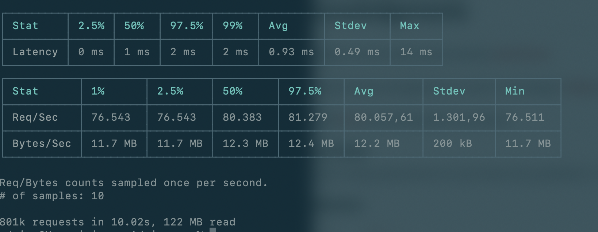
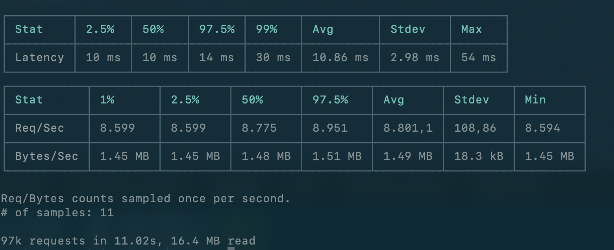
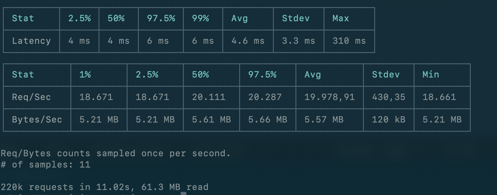
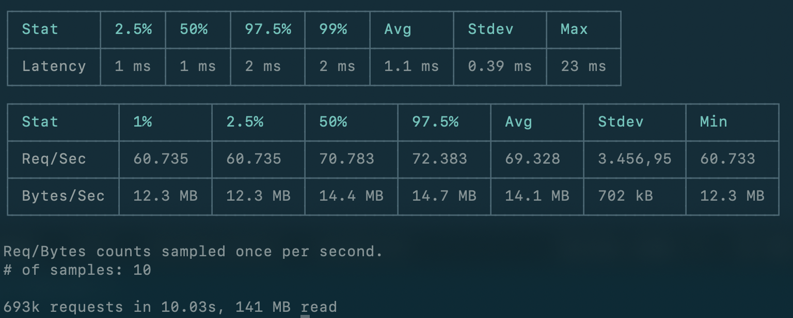
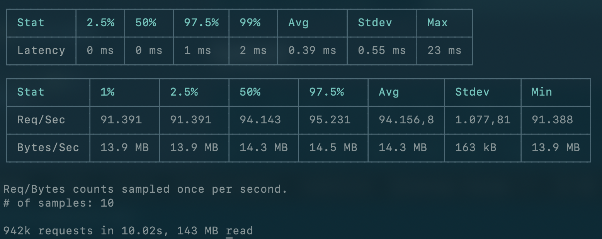
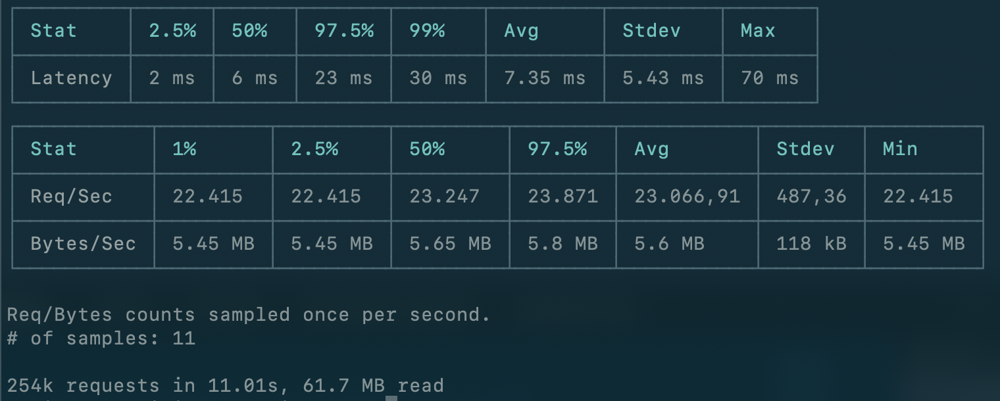

# Simple HTTP Request Speeds

|Rank| Name | Requests/10s |
| ---| --- | ---|
|1|Rust|942k|
|2|GO|801k|
|3|C#|693k|
|4|PHP|254k|
|5|Node.js|225k|
|6|Python3|97k|

## GO

## Python3

## node.js

## C#

## Rust

## PHP

