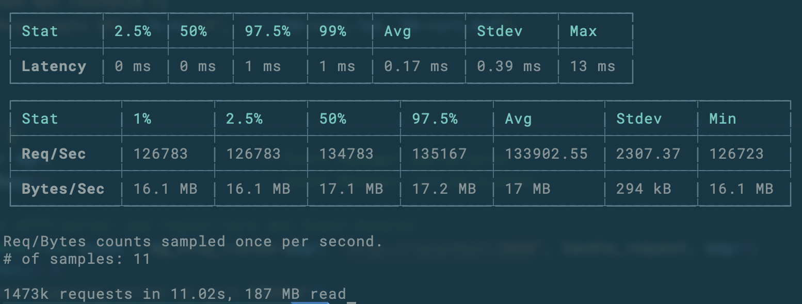

# Simple HTTP Request Speeds

|Rank| Name | Requests/10s |
| ---| --- | ---|
|1|C|1473k|
|2|Rust|942k|
|3|GO|801k|
|4|C#|693k|
|5|PHP|254k|
|6|Node.js|225k|
|7|Python3|97k|

## C

## GO

## Python3

## node.js

## C#

## Rust

## PHP

